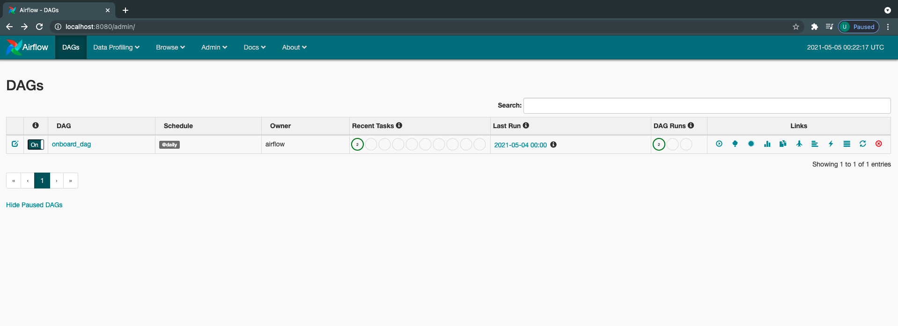
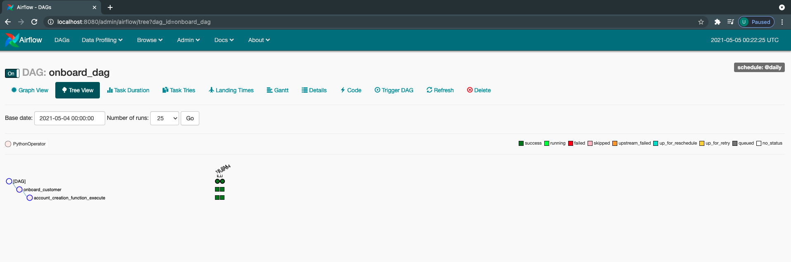

# Example: Apache Airflow for creating, monitoring and scheduling workflows.

## Installation

This requires [python] 3+ 

Install the dependencies and devDependencies and start the server.

```sh
clone the repository locally

  cd wf_airflow
  docker-compose up --build
```

## Folder structure for Dags

dags(jobs) are stored in the folder ./dags
The reference to the dag folder need to be configured in docker-compose.yml file.
Note:The paths are for reference and can be saved at your preferred path.

```    
webserver:
      build: ./dockerfiles
      restart: always
      depends_on:
        - postgres
      environment:
        - LOAD_EX=n
        - EXECUTOR=Local
      logging:
        options:
          max-size: 10m
          max-file: "3"
      volumes:
          - ./dags:/usr/local/airflow/dags

```

## Apache Airflow Web Page User View
```sh
The above command will run a server on port 8080 and applciation be accessed @ 
http://localhost:8080

```
## UI - Dashboard View


## UI - Tree View


